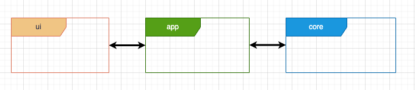

# Importação e Configuração do módulo de UI

Para a criação da UI (neste caso menus), será necessário adicionar ao IDE uma bibliteca.
Neste caso vamos utilizar uma biblioteca denominada de `UI`que se encontra num repositório.

Os passos a executar (IntelliJ IDEA) são os descritos abaixo

## 1. Efetuar o clone da biblioteca para o vosso PC

Numa pasta à vossa escolha (que não esteja dentro de outro repo) executar o comando git clone
```terminal
git clone git@git.atec.kissweb.pt:atec/<caminho_para_repositorio_a_ser_fornecido.git>
```
> **IMPORTANTE:** Nota que em aula o formador irá disponibilizar o repositório na pasta de repositórios usados pela turma. Irão ter duas pastas distintas. 
> Uma onde está o projeto e outra a UI. Cada uma é um Repositório. Veja a imagem abaixo.


## 2. Adicionar a biblioteca como um módulo ao vosso projeto

- Abrir a estrutura do projeto e clicar em adicionar módulo (+) > Import Module ;
  
  

- Selecionar a pasta que criámos no passo 1 (UI)
  
  

- Selecionar `Import module from external model` e selecionar `Maven`

  

- No final a vossa aplicação, neste tutorial intitulada de `escola-teste` possuirá 4 módulos. A aplicação em sí (escola-teste) e:
  - `core`: modelo de dados da nossa aplicação
  - `app`: Lógica dos menús a implementar
  - `ui`: Biblioteca que apoia a construção dos menús
  
  

> No final, no explorador (barra do lado esquerdo), selecionando as vistas `Project` e `Package`deverá conseguir observar algo do género:


> Reparar ainda que a nossa aplicação irá ser baseada em dois repositórios. Se abrirem o menu GIT (Canto inferior esquerdo) podem observar:


## 3. Definir as dependências entre Módulos

Na nossa aplicação utilizamos o Maven (ferramenta de automação e gestão de projetos de _software_, especialmente popular na comunidade Java).
Deste modo e para implementar uma arquitetura como a descrita no ficheiro `Arquitetura.md` teremos que dfinir as depêndencias
entre os diferentes módulos, ou por outras palavras, que módulos podem comunicar (ver/aceder) a que módulos.

No fundo, pretende-se que o nosso módulo `app` comunique com o `core` e a ùi`



Para isso devemos adicionar essas dependências ao ficheiro `pom.xml` do módulo app.
Esta tarefa pode ser feita no IDE, como através da edição do ficheiro.

`pom.xml` (app):
```xml
<!--Excerto das dependências-->
<dependencies>
        <dependency>
            <groupId>atec.tpsi1223</groupId>
            <artifactId>core</artifactId>
            <version>1.0-SNAPSHOT</version>
        </dependency>
        <dependency>
            <groupId>atec.poo.ui</groupId>
            <artifactId>ui</artifactId>
            <version>1.0-SNAPSHOT</version>
        </dependency>
</dependencies>

```

Caso se pretenda que o módulo `core` possua acesso à `ui` (para criar objetos e utilizar classes) podemos ainda adicionar essa dependência.
Não é uma prática recomendada, mas pode simplificar o código, tornando, contudo, mais complexa uma tarefa posterior de atualização desse mesmo código, ou de uma das bibliotecas da aplicação.
No fundo, se quisermos uma arquitetura conforme a imagem abaixo, teremos que editar e alterar o ficheiro `pom.xml`do `core` para lhe indicar a existência da `ui`:


`pom.xml` (core)
```xml
<!--Excerto das dependências-->
<dependencies>
        <dependency>
            <groupId>atec.poo.ui</groupId>
            <artifactId>ui</artifactId>
            <version>1.0-SNAPSHOT</version>
        </dependency>
</dependencies>
```


