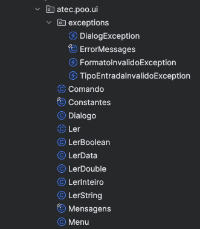
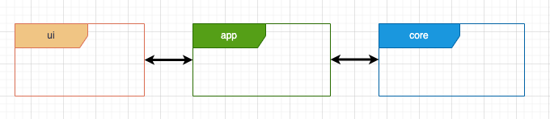

# Módulo UI

<!-- TOC -->
* [Módulo UI](#módulo-ui)
  * [Enquadramento e principais conceitos](#enquadramento-e-principais-conceitos)
    * [Padrão de arquitetura em Camadas](#padrão-de-arquitetura-em-camadas)
      * [Camada de Apresentação / User Interface -  `ui`](#camada-de-apresentação--user-interface---ui)
      * [Camada de Serviços / Aplicação -  `app`](#camada-de-serviços--aplicação---app)
      * [Camada de Domínio - `core`](#camada-de-domínio---core)
  * [Principais Classes e exemplos da framework `ui`](#principais-classes-e-exemplos-da-framework-ui)
    * [Classe `Menu`](#classe-menu)
    * [Classe `Comando`](#classe-comando)
    * [Classe `Dialogo`](#classe-dialogo)
    * [Classe `Ler` e subclasses especializadas](#classe-ler-e-subclasses-especializadas)
      * [Exemplos de utilização](#exemplos-de-utilização)
      * [**O que é uma Regex?**](#o-que-é-uma-regex)
    * [Classe `Constantes`](#classe-constantes)
    * [Exceções](#exceções)
<!-- TOC -->

O Módulo UI é uma biblioteca com Classes e Interfaces que apoia a criação de menus e se responsabiliza pela interação com o Utilizador

## Enquadramento e principais conceitos

A biblioteca (framework) encontra-se dentro do package `atec.poo.ui` e, conforme imagem abaixo, possui um conjunto de classes que podem ser utilizadas para implementar um sistema de menus (funcionalidades do sistema), as quais serão implementados num módulo diferente (`app`).



Tipicamente essa lógica de implementação (os menus) será efetuada no módulo `app`, o qual é responsável por gerir toda a lógica da aplicação,
interligando a biblioteca que é responsável pela gestão da interação com o utilizador (`ui`) com toda a lógica de negócio (`core`)



### Padrão de arquitetura em Camadas

A arquitetura em camadas, é uma abordagem estruturada para organizar aplicações de forma que cada camada tenha responsabilidades claras e distintas. Isso facilita a manutenção, escalabilidade e entendimento do sistema.
1. **Camada de Apresentação (UI/Interface do Utilizador)**
   - **Responsabilidade**: Interagir com os Utilizadores finais. Receber entradas e exibir saídas.
   - **Componentes Comuns**: Controladores, views, APIs REST, páginas web, interfaces gráficas.
2. **Camada de Aplicação**
   - **Responsabilidade**: Orquestrar a execução das operações de negócio. Coordenar tarefas e gerenciar fluxos de trabalho.
   - **Componentes Comuns**: Serviços de aplicação, gestores de transação, controladores de fluxo.
3. **Camada de Domínio**
   - **Responsabilidade**: Contém a lógica de negócio central do sistema. Definir as regras de negócio e os comportamentos principais.
   - **Componentes Comuns:** Entidades, agregados, repositórios, serviços de domínio.
4. Camada de Infraestrutura
   **Responsabilidade:** Suporte técnico para outras camadas. Implementar interfaces e fornecer acesso a recursos externos.
   **Componentes Comuns:** Implementações de repositórios, serviços de comunicação, bibliotecas de terceiros, acesso a bases de dados, etc.

> Veja abaixo uma explicação mais detalhada das camadas, numa lógica do que se pretente neata UFCD. Para o efeito não se apresenta a camada de infraestrutura pois não irá ser utilizado uma Ligação a Bases de Dados

#### Camada de Apresentação / User Interface -  `ui`

A camada de apresentação é responsável pela interação com o utilizador. 
É esta camada a responsável por apresentar os dados ao utilizador e recolher os dados inseridos pelo utilizador. 
Esta camada é totalmente suportada pelo módulo `ui`. (Os formandos não necessitam alterar a framework)

Esta framework (conjunto de funcionalidades) é de código aberto e foi desenvolvida pelo Instituto superior Técnico e adaptada pelo formador para as aulas de POO

#### Camada de Serviços / Aplicação -  `app`

A camada de serviços é a camada intermédia entre a camada de lógica de negócio (Core) e a camada de apresentação. 
A camada de serviços é uma camada cujas entidades são relativamente simples. Esta camada é responsável pela definição da interação com o utilizador que deve ser suportada pela aplicação. 
Ou seja, implementa as funcionalidades (menus, etc), onde cada funcionalidade que se quer oferecer ao utilizador deve ser concretizada utilizando as funcionalidades da camada `ui`.

A classe abstrata `Comando` fornecida pela framework `ui` é uma abstração que representa genericamente uma funcionalidade sobre a aplicação que se quer disponibilizar ao utilizador. 

Por exemplo, no contexto de uma aplicação Escola, se quisermos que o utilizador possa criar um estudante ou uma turma, então teremos que ter duas subclasses de `Comando`, cada uma responsável por uma destas funcionalidades. 
Cada subclasse implementada será responsável por pedir os dados ao utilizador necessários para realizar a funcionalidade pretendida (Utilizando a classe `Ler) e também por apresentar o resultado que resulta da execução da funcionalidade pretendidada.

> Mais abaixo, neste tutorial, estarão exemplos de como utilizar cada Classe da framework.

#### Camada de Domínio - `core`

Esta camada (também designada como camada de **lógica de negócio** ou camada **core**) contém a realização de todas as entidades que são responsáveis pela lógica de negócio da aplicação a desenvolver. 
Esta camada é assim constituída por um conjunto de classes que modela e concretiza o domínio da aplicação a desenvolver. Por exemplo, numa aplicação para uma escola, as entidades do domínio incluiriam as classes Escola, Estudante e Professor as quais concretizariam as funcionalidades inerentes às entidades do mundo real modeladas por estas classes.

> O Core de uma aplicação é o conjunto de classes que modela e realiza o problema proposto. 
> A interface com o utilizador (ui) dá um aspeto visível possível através do qual se podem realizar pedidos ao núcleo. 
> Uma aplicação pode suportar diferentes interfaces (por exemplo gráficas como o JavaFX, Swing, etc.) com o utilizador. Por esta razão, o núcleo nunca deve aceder à `ui`. Da mesma forma, a _interface_ utilizador não deve realizar operações que representam lógica de negócio relacionada com o core da aplicação, mas apenas recolher dados, passá-los a um ou mais métodos do core, e apresentar os resultados obtidos do core.


Segue uma versão **atualizada** e **completa** da documentação sobre as **principais classes e exemplos** da tua framework `ui`, já incluindo explicações didáticas e exemplos reais (usando os trechos que enviaste).

---

## Principais Classes e exemplos da framework `ui`

A biblioteca `ui` fornece uma abstração para criar interfaces de linha de comandos de forma simples, organizada e reutilizável, baseada na arquitetura do Instituto Superior Técnico (IST).
O objetivo é que os alunos se concentrem na **lógica do domínio (core)**, enquanto a interação com o utilizador é tratada por uma camada de UI consistente e fácil de usar.

---

### Classe `Menu`

A classe `Menu` representa um **conjunto de comandos** (ações) que o utilizador pode escolher interativamente.
O menu é inicializado com um **título** e um **array de comandos**, e gere a navegação e execução dessas opções.

**Principais responsabilidades:**

* Apresentar uma lista de opções ao utilizador.
* Executar a ação associada ao comando escolhido.
* Permitir menus aninhados (menus dentro de menus).

**Exemplo prático:**

```java
public class Menu extends atec.poo.ui.Menu {
    public Menu(Gestor gestor) {
        super(Labels.TITLE, new Comando[]{
            new DoCreateStudent(gestor),
            new DoListStudents(gestor),
            new DoShowStudent(gestor)
        });
    }
}
```

Neste exemplo, o menu de alunos apresenta três comandos: **criar**, **listar** e **mostrar** um aluno.

---

### Classe `Comando`

A classe `Comando<T>` representa uma **ação concreta** a executar sobre um determinado **receptor** (objeto core).
Cada comando:

* Tem um título/label.
* Interage com o utilizador através de **ler inputs** e **mostrar mensagens**.
* Pode lançar exceções específicas de UI (como `DialogException`).

**Exemplo prático:**

```java
public class DoCreateStudent extends Comando<Gestor> {

    private LerString nif;
    private LerString nome;

    public DoCreateStudent(Gestor gestor) {
        super(gestor, Labels.CREATE_STUDENT);
        this.nome = new LerString(Labels.ASK_NAME, null);
        this.nif = new LerString(Labels.ASK_NIF, Constantes.NIF_REGEX);
    }

    @Override
    public void executar() throws DialogException {
        ui.lerInput(this.nome);
        ui.lerInput(this.nif);
        int num = this.getReceptor().criarAluno(this.nif.getValor(), this.nome.getValor());
        ui.escreveLinha(Labels.estudanteCriadoSucesso(this.nome.getValor(), num));
    }
}
```

---

### Classe `Dialogo`

A classe `Dialogo` (ou `Dialogo<T>`) atua como base para interações com o utilizador que **não são apenas menus**, mas **sequências de inputs** para realizar uma ação.
É especialmente útil para formular **"diálogos" interativos**, como pedir dados ao utilizador, validar e devolver valores.

---

### Classe `Ler` e subclasses especializadas

A classe abstrata `Ler<T>` encapsula toda a lógica de **pedir valores ao utilizador**, **validar o tipo de dado** e **garantir que o valor inserido é válido**.
Quando o utilizador introduz um valor inválido, a framework volta a pedir o input até obter um valor coerente com o tipo pretendido.
Depois de lido e validado, é possível obter o valor com o método **`getValor()`**.

No caso de **strings**, é ainda possível passar uma **expressão regular (regex)** no construtor para validar automaticamente o formato do texto.

**Subclasses disponíveis:**

* `LerString` – Para ler textos (com ou sem validação via regex).
* `LerInteiro` – Para ler números inteiros.
* `LerDouble` – Para ler números decimais.
* `LerData` – Para ler datas (ex.: `dd/MM/yyyy`).
* `LerHora` – Para ler horas (ex.: `HH:mm`).
* `LerBoolean` – Para ler valores booleanos (sim/não).

---

#### Exemplos de utilização

**1. Ler uma String simples:**

```java
LerString nome = new LerString("Insere o nome do aluno:", null);
ui.lerInput(nome);
System.out.println("Nome introduzido: " + nome.getValor());
```

---

**2. Ler uma String com validação por regex (NIF):

```java
LerString nif = new LerString("Insere o NIF (9 dígitos):", Constantes.NIF_REGEX);
ui.lerInput(nif);
System.out.println("NIF válido: " + nif.getValor());
```

*(Se o utilizador escrever menos de 9 dígitos, o sistema volta a pedir o valor.)*

---

**3. Ler um número inteiro (ex.: idade):**

```java
LerInteiro idade = new LerInteiro("Insere a idade:");
ui.lerInput(idade);
System.out.println("Idade: " + idade.getValor());
```

---

**4. Ler um número decimal (ex.: salário):

```java
LerDouble salario = new LerDouble("Insere o salário:");
ui.lerInput(salario);
System.out.println("Salário: " + salario.getValor());
```

---

**5. Ler uma data (ex.: data de nascimento):**

```java
LerData dataNasc = new LerData("Insere a data de nascimento (dd/MM/yyyy):");
ui.lerInput(dataNasc);
System.out.println("Data de nascimento: " + dataNasc.getValor());
```

---

**6. Ler uma hora (ex.: hora de entrada):**

```java
LerHora horaEntrada = new LerHora("Insere a hora de entrada (HH:mm):");
ui.lerInput(horaEntrada);
System.out.println("Hora de entrada: " + horaEntrada.getValor());
```

---

**7. Ler um valor booleano (ex.: ativo/inativo):**

```java
LerBoolean ativo = new LerBoolean("Está ativo? (s/n):");
ui.lerInput(ativo);
System.out.println("Ativo: " + ativo.getValor());
```

---

#### **O que é uma Regex?**

Uma **expressão regular (regex)** é um padrão textual usado para **validar ou encontrar cadeias de caracteres**.
Por exemplo:

* `\\d{9}` valida **9 dígitos** (como um NIF).
* `[A-Za-z]+` aceita apenas **letras**.
* `\\d{2}/\\d{2}/\\d{4}` valida uma **data** no formato `dd/MM/yyyy`.

No caso de `LerString`, quando se passa uma regex, o sistema apenas aceita a entrada se o texto respeitar esse padrão. Caso contrário, volta a pedir a informação.

---

### Classe `Constantes`

Esta classe serve para armazenar **valores comuns e reutilizáveis** pela framework ou pela aplicação.
Exemplo:

```java
public class Constantes {
    public static final String NIF_REGEX = "\\d{9}";
}
```

---

### Exceções

A framework define **exceções personalizadas** para tratar **erros de input** e **problemas de interação** com o utilizador. Estas exceções permitem separar a lógica de negócio do tratamento de erros na interface.

**Principais exceções:**

* **`DialogException`** – Exceção base para todos os erros que ocorrem durante um diálogo com o utilizador.
* **`FormatoInvalidoException`** – Lançada quando o valor introduzido não corresponde ao **formato esperado** (por exemplo, uma data mal formatada ou um número onde era esperado um decimal).
* **`TipoEntradaInvalidoException`** – Lançada quando o valor introduzido **não é do tipo correto** (por exemplo, texto num campo numérico).

---

**Como são tratadas?**

Quando uma exceção que **herda de `DialogException`** é lançada durante a execução de um comando ou durante a leitura de um input, a **UI captura automaticamente essa exceção** e **mostra a respetiva mensagem de erro no `stdout`** (normalmente no terminal).
Depois disso, o fluxo do diálogo continua, permitindo ao utilizador corrigir o erro e voltar a tentar.

**Exemplo prático:**

```java
try {
    ui.lerInput(new LerInteiro("Insere um número inteiro:"));
} catch (DialogException e) {
    // Esta parte raramente é usada diretamente pelos alunos, 
    // pois a UI já trata o erro e mostra a mensagem automaticamente.
    System.out.println("Erro: " + e.getMessage());
}
```

---

**Comportamento típico**

* Se o utilizador introduzir "abc" quando é esperado um número (`LerInteiro`), é lançada uma **`TipoEntradaInvalidoException`**.
* A **UI apanha esta exceção** e mostra algo como:

  ```
  ERRO: O valor introduzido não é um número válido.
  ```
* De seguida, a UI volta a pedir o valor, até que o utilizador introduza um valor válido.

---


